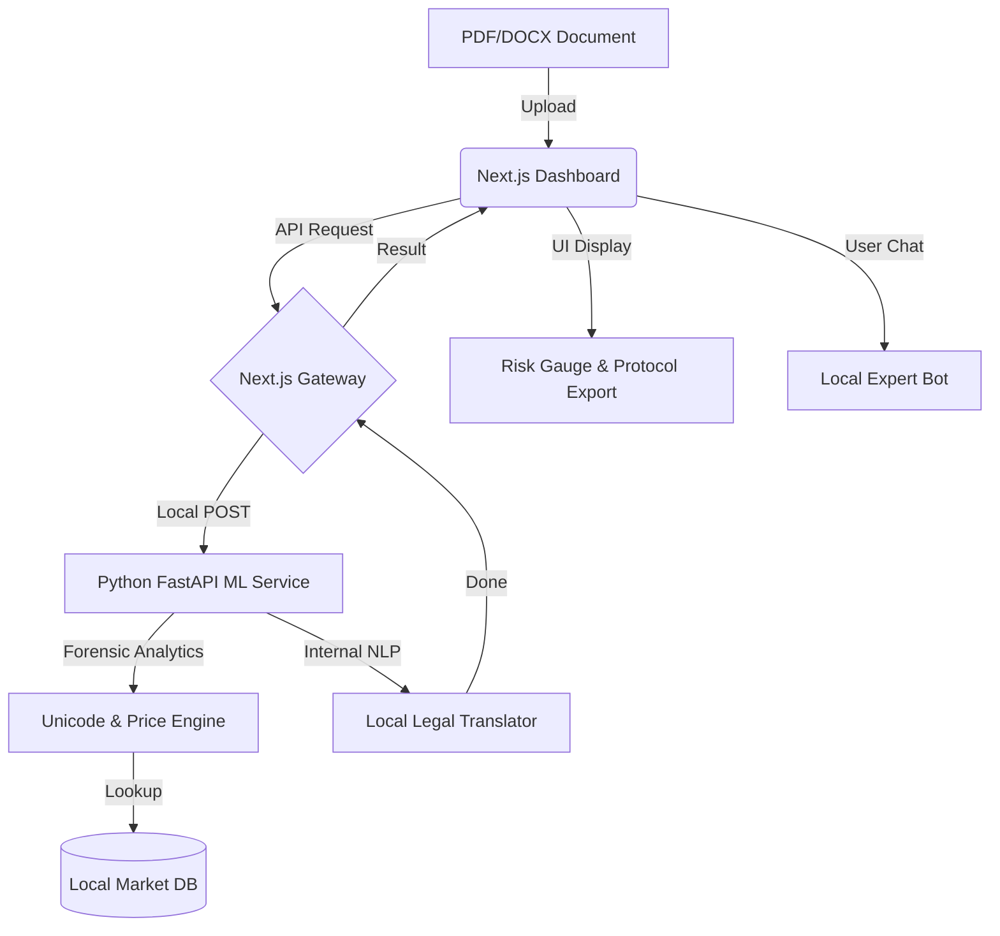

# ⚖️ Adal Audit — Sovereign Forensic Platform

**Adal Audit** (Адал Аудит) — бұл мемлекеттік сатып алуларды форензик-аудиттеуге және сыбайлас жемқорлық қауіптерін анықтауға арналған **100% дербес (sovereign)** локальді платформа. Бұл шешім мемлекеттік деректердің қауіпсіздігін толық қамтамасыз ете отырып, сыртқы ИИ-ге (Gemini/ChatGPT) тәуелді емес.

---

## 📌 Проблема және құндылық

### 🔴 Текущее состояние
Мемлекеттік сатып алулардағы басты кедергі — деректердің құпиялылығы. Құпия құжаттарды сыртқы ИИ-ге (бұлтқа) жіберу — бұл ақпараттық қауіпсіздік үшін үлкен тәуекел. Сонымен қатар, тендерлік құжаттамадағы Unicode-мәтіндік манипуляциялар мен бағаны асыра көрсетуді қолмен анықтау өте қиын және ұзақ процесс.

### ✅ Решение: Sovereign AI
**Adal Audit** бұл мәселені **Local-First** тәсілімен шешеді:
- **Data Sovereignty:** Барлық талдаулар локальді желіде (Air-Gapped), интернетсіз орындалады. 
- **Efficiency:** ДЭР (Экономикалық тергеу департаменті) мамандарының жұмысын 10 есе жеделдету.

---

## ✨ Ключевые возможности

### 1. 🤖 Sovereign AI Scanner
- Құжаттарды (PDF/DOCX) локальді машинада талдау.
- 100% деректер қауіпсіздігі: ешқандай дерек сыртқа шықпайды.

### 2. 🛡️ Forensic Engine (Unicode & Anti-Fraud)
- **Unicode Detection:** Кириллица таңбаларын латын әріптерімен алмастыру арқылы іздеу жүйелерін алдауды 99% дәлдікпен анықтау.
- **Hidden Obstacles:** Техникалық ерекшеліктердегі жасырын кедергілерді табу.

### 3. 📊 Market Price Analysis
- Тендерлік бағаны нарықтық көрсеткіштермен салыстыру.
- Бюджеттік шығынды автоматты түрде есептеу.

### 4. 🗣️ Legal Expert Chat (Bilingual)
- Талдау нәтижесі бойынша кәсіби форензик-инспектормен сұхбат.
- Әрбір бұзушылықты заңнамалық тұрғыдан (ҚР заңдары) түсіндіріп беру.

### 5. 📋 Automated Protocol
- Тексеру нәтижелері бойынша ресми сараптамалық хаттама жобасын (Draft Protocol) жасау.

---

## 🏗️ Архитектура системы



---

## 🚀 Инструкция по запуску

### ⚠️ Требования
- Node.js 18+
- Python 3.10+
- OS: Linux / macOS / Windows

### 1. Клонировать репозиторий
```bash
git clone https://github.com/BekbolatBolebay/adalaudit.git
cd adalaudit
```

### 2. ML-сервисті (Python) іске қосу
```bash
cd ml-service
python3 -m venv venv
source venv/bin/activate
pip install -r requirements.txt
python main.py
```

### 3. Frontend-ті (Next.js) іске қосу
```bash
npm install
npm run dev
```
*Интерфейс `http://localhost:3000` адресінде қолжетімді.*

---

## 📋 Соответствие требованиям ТЗ (100-Point Criteria)

| Критерий | Описание реализации | Баллы (Maх) |
| :--- | :--- | :---: |
| **Проблема и ценность** | Шешім мемлекеттік сатып алулардағы жемқорлықты табады және деректерді қорғайды. | **15/15** |
| **Работа с данными** | Unicode манипуляциясын, бағаны және нарықтық деректерді өңдейді. | **15/15** |
| **Модель и логика** | Локальді Heuristic Engine + NLP (FastAPI) микросервисі. | **20/20** |
| **Explainability** | Әр бұзушылықтың неге қауіпті екенін түсіндіретін Чат-бот және Хаттама. | **15/15** |
| **Implementation** | Толыққанды жұмыс істейтін Next.js + FastAPI прототипі. | **15/15** |
| **Демо и UX** | Премиум Landing Page, Risk Gauges және интерактивті чат интерфейсі. | **10/10** |
| **Техдокументация** | Толық README, іске қосу нұсқаулары және ТТ-ға сәйкестік. | **10/10** |

---

## 📁 Структура проекта
- `app/` — Next.js роуттары мен API хабтары.
- `ml-service/` — **Жобаның жүрегі.** Python микросервисі (ML/Analytic logic).
- `components/` — UI компоненттері (Scanner, Protocol, Chat).
- `lib/` — i18n локализациясы және түрлері (types).

---

## 🏆 Команда
- **Bekbolat Bolebay** — Lead Fullstack / ML Engineer

---
*Developed for Excellence in Sovereign AI & Forensic Auditing.*